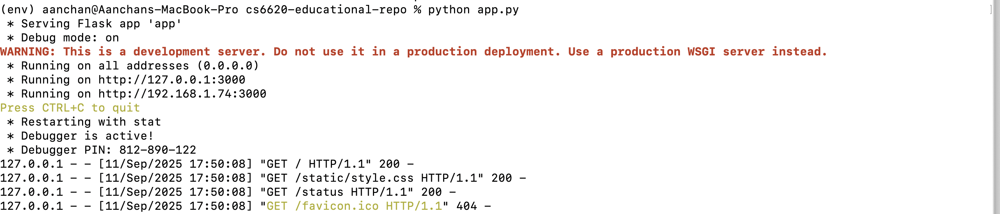
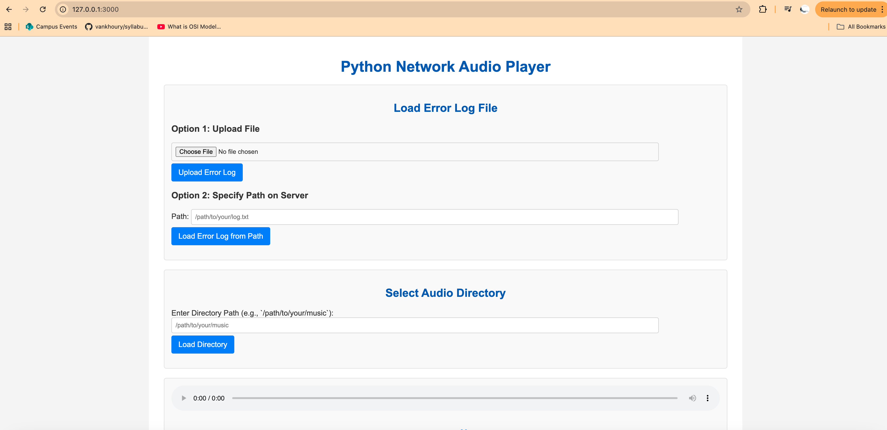

## 🚀 Using This Repository

### **For Students**
```bash
# Clone the repository
git clone <repository-url>

# Explore available branches
git branch -a

# Checkout a specific week
git checkout week-02

# Install the app locally

1. python -m venv env #create a virtualenv
2. source env/bin/activate # activate the virtualenv
3. pip install -r requirements.txt # install the app locally
4. python app.py # this runs the app

# Your terminal should look like this



# Navigate to 127.0.0.1:3000 in the browser, the app should render like this



